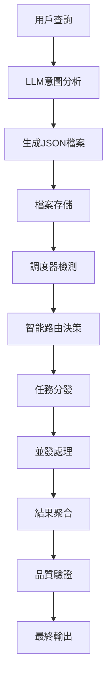

# LLM生成JSON檔案處理系統架構設計

## 📋 概述

本文檔詳細說明LLM生成的JSON檔案在JobSpy系統中的存儲路徑、調度器/智能路由器的處理機制，以及系統架構的最佳實踐方案。

## 🗂️ JSON檔案存儲路徑架構

### 1. 主要存儲目錄結構

```
JobSpy/
├── data/
│   ├── llm_generated/           # LLM生成的JSON檔案主目錄
│   │   ├── raw/                 # 原始LLM輸出
│   │   │   ├── by_date/         # 按日期分類
│   │   │   │   ├── 2025-01-27/
│   │   │   │   ├── 2025-01-28/
│   │   │   │   └── ...
│   │   │   ├── by_provider/     # 按LLM提供商分類
│   │   │   │   ├── openai/
│   │   │   │   ├── anthropic/
│   │   │   │   ├── google/
│   │   │   │   └── deepseek/
│   │   │   └── by_task_type/    # 按任務類型分類
│   │   │       ├── intent_analysis/
│   │   │       ├── job_extraction/
│   │   │       ├── data_enrichment/
│   │   │       └── quality_validation/
│   │   ├── processed/           # 處理後的JSON檔案
│   │   │   ├── validated/       # 已驗證的檔案
│   │   │   ├── enriched/        # 已豐富的檔案
│   │   │   └── standardized/    # 已標準化的檔案
│   │   ├── queue/               # 待處理佇列
│   │   │   ├── pending/         # 待處理
│   │   │   ├── processing/      # 處理中
│   │   │   ├── completed/       # 已完成
│   │   │   └── failed/          # 處理失敗
│   │   └── archive/             # 歸檔檔案
│   │       ├── daily/
│   │       ├── weekly/
│   │       └── monthly/
│   ├── job_data/                # 最終職位數據
│   │   ├── raw/                 # 原始爬蟲數據
│   │   ├── processed/           # ETL處理後數據
│   │   └── exports/             # 導出數據
│   └── logs/                    # 系統日誌
│       ├── llm_processing/
│       ├── scheduler/
│       └── router/
└── config/
    ├── llm_config.json          # LLM配置
    ├── scheduler_config.json    # 調度器配置
    └── storage_config.json     # 存儲配置
```

### 2. 檔案命名規範

```python
# LLM生成JSON檔案命名格式
{timestamp}_{task_type}_{provider}_{session_id}.json

# 範例:
20250127_143052_intent_analysis_openai_abc123.json
20250127_143055_job_extraction_anthropic_def456.json
20250127_143058_data_enrichment_google_ghi789.json
```

### 3. 檔案元數據結構

```json
{
  "metadata": {
    "file_id": "uuid-string",
    "created_at": "2025-01-27T14:30:52Z",
    "task_type": "intent_analysis",
    "llm_provider": "openai",
    "model_name": "gpt-4",
    "session_id": "abc123",
    "user_query": "python developer jobs in sydney",
    "processing_status": "pending",
    "file_size": 2048,
    "checksum": "sha256-hash"
  },
  "content": {
    "intent": {
      "is_job_related": true,
      "confidence": 0.95,
      "job_title": "python developer",
      "location": "sydney",
      "skills": ["python", "programming"],
      "experience_level": "mid"
    }
  }
}
```

## 🤖 調度器/智能路由器處理機制

### 1. 處理流程架構



### 2. 調度器核心組件

#### A. 檔案監控器 (File Watcher)

```python
class LLMFileWatcher:
    """
    LLM生成檔案監控器
    實時監控新生成的JSON檔案
    """
    
    def __init__(self, watch_directory: str):
        self.watch_directory = Path(watch_directory)
        self.file_queue = asyncio.Queue()
        self.processing_status = {}
    
    async def start_watching(self):
        """開始監控檔案變化"""
        async for event in self._watch_directory_changes():
            if event.event_type == 'created' and event.src_path.endswith('.json'):
                await self._handle_new_file(event.src_path)
    
    async def _handle_new_file(self, file_path: str):
        """處理新檔案"""
        file_info = await self._extract_file_metadata(file_path)
        await self.file_queue.put(file_info)
        self.processing_status[file_path] = 'queued'
```

#### B. 智能任務調度器 (Smart Task Scheduler)

```python
class SmartTaskScheduler:
    """
    智能任務調度器
    根據任務類型和優先級進行調度
    """
    
    def __init__(self, max_concurrent_tasks: int = 10):
        self.max_concurrent_tasks = max_concurrent_tasks
        self.task_queues = {
            'high_priority': asyncio.PriorityQueue(),
            'normal_priority': asyncio.PriorityQueue(),
            'low_priority': asyncio.PriorityQueue()
        }
        self.active_tasks = set()
        self.task_history = []
    
    async def schedule_task(self, task_info: Dict):
        """調度任務"""
        priority = self._determine_priority(task_info)
        queue_name = f"{priority}_priority"
        
        await self.task_queues[queue_name].put(
            (self._calculate_priority_score(task_info), task_info)
        )
    
    def _determine_priority(self, task_info: Dict) -> str:
        """確定任務優先級"""
        task_type = task_info.get('task_type')
        user_tier = task_info.get('user_tier', 'free')
        
        # 高優先級：付費用戶的意圖分析
        if user_tier == 'premium' and task_type == 'intent_analysis':
            return 'high'
        
        # 中優先級：一般任務
        if task_type in ['job_extraction', 'data_enrichment']:
            return 'normal'
        
        # 低優先級：批量處理任務
        return 'low'
```

#### C. 智能路由決策引擎

```python
class IntelligentRoutingEngine:
    """
    智能路由決策引擎
    根據任務內容選擇最適合的處理策略
    """
    
    def __init__(self):
        self.routing_rules = self._load_routing_rules()
        self.performance_metrics = {}
        self.load_balancer = LoadBalancer()
    
    async def route_task(self, task_info: Dict) -> RoutingDecision:
        """路由任務到最適合的處理器"""
        
        # 1. 分析任務特徵
        task_features = self._extract_task_features(task_info)
        
        # 2. 地理位置檢測
        geographic_context = self._detect_geographic_context(task_info)
        
        # 3. 選擇處理策略
        processing_strategy = self._select_processing_strategy(
            task_features, geographic_context
        )
        
        # 4. 負載均衡
        selected_workers = self.load_balancer.select_workers(
            processing_strategy, task_info
        )
        
        return RoutingDecision(
            strategy=processing_strategy,
            workers=selected_workers,
            estimated_time=self._estimate_processing_time(task_info),
            confidence=self._calculate_confidence(task_features)
        )
    
    def _select_processing_strategy(self, features: Dict, geo_context: Dict) -> str:
        """選擇處理策略"""
        
        # 澳洲地區優先使用Seek
        if geo_context.get('region') == 'Australia':
            return 'seek_focused_strategy'
        
        # 美國地區使用Indeed + ZipRecruiter
        elif geo_context.get('region') == 'North_America':
            return 'indeed_ziprecruiter_strategy'
        
        # 全球策略
        else:
            return 'global_multi_platform_strategy'
```

### 3. 處理模式選擇

#### A. 即時處理模式 (Real-time Processing)

```python
class RealTimeProcessor:
    """
    即時處理模式
    適用於：用戶互動查詢、高優先級任務
    """
    
    async def process_immediately(self, json_file_path: str):
        """立即處理JSON檔案"""
        
        # 1. 載入並驗證JSON
        task_data = await self._load_and_validate_json(json_file_path)
        
        # 2. 智能路由決策
        routing_decision = await self.routing_engine.route_task(task_data)
        
        # 3. 並發執行
        results = await self._execute_concurrent_scraping(
            routing_decision, task_data
        )
        
        # 4. 即時返回結果
        return await self._format_immediate_response(results)
```

#### B. 批量處理模式 (Batch Processing)

```python
class BatchProcessor:
    """
    批量處理模式
    適用於：大量數據處理、非即時需求
    """
    
    def __init__(self, batch_size: int = 50, processing_interval: int = 300):
        self.batch_size = batch_size
        self.processing_interval = processing_interval  # 5分鐘
        self.pending_files = []
    
    async def add_to_batch(self, json_file_path: str):
        """添加到批量處理佇列"""
        self.pending_files.append(json_file_path)
        
        if len(self.pending_files) >= self.batch_size:
            await self._process_batch()
    
    async def _process_batch(self):
        """處理一批檔案"""
        batch_files = self.pending_files[:self.batch_size]
        self.pending_files = self.pending_files[self.batch_size:]
        
        # 並發處理批量檔案
        tasks = [self._process_single_file(file_path) for file_path in batch_files]
        results = await asyncio.gather(*tasks, return_exceptions=True)
        
        await self._save_batch_results(results)
```

#### C. 混合處理模式 (Hybrid Processing)

```python
class HybridProcessor:
    """
    混合處理模式
    結合即時和批量處理的優勢
    """
    
    def __init__(self):
        self.realtime_processor = RealTimeProcessor()
        self.batch_processor = BatchProcessor()
        self.priority_classifier = PriorityClassifier()
    
    async def process_json_file(self, json_file_path: str):
        """智能選擇處理模式"""
        
        # 分析任務優先級
        priority = await self.priority_classifier.classify(json_file_path)
        
        if priority == 'high':
            # 高優先級：即時處理
            return await self.realtime_processor.process_immediately(json_file_path)
        else:
            # 低優先級：批量處理
            await self.batch_processor.add_to_batch(json_file_path)
            return {'status': 'queued_for_batch_processing'}
```

## ⚙️ 系統架構最佳實踐

### 1. 高可用性設計

#### A. 容錯機制

```python
class FaultTolerantProcessor:
    """
    容錯處理器
    確保系統在部分組件失敗時仍能正常運行
    """
    
    def __init__(self):
        self.retry_config = {
            'max_retries': 3,
            'backoff_factor': 2,
            'timeout': 30
        }
        self.circuit_breaker = CircuitBreaker()
        self.health_checker = HealthChecker()
    
    async def process_with_fallback(self, task_info: Dict):
        """帶容錯的處理"""
        
        try:
            # 主要處理路徑
            return await self._primary_processing(task_info)
        
        except Exception as e:
            logger.warning(f"主要處理失敗: {e}，嘗試備用方案")
            
            # 備用處理路徑
            return await self._fallback_processing(task_info)
    
    async def _fallback_processing(self, task_info: Dict):
        """備用處理方案"""
        
        # 1. 使用緩存數據
        cached_result = await self._try_cache_lookup(task_info)
        if cached_result:
            return cached_result
        
        # 2. 降級到基本功能
        return await self._basic_processing(task_info)
```

#### B. 負載均衡

```python
class LoadBalancer:
    """
    負載均衡器
    智能分配任務到不同的處理節點
    """
    
    def __init__(self):
        self.worker_nodes = self._discover_worker_nodes()
        self.performance_metrics = {}
        self.load_distribution = {}
    
    async def select_optimal_workers(self, task_info: Dict) -> List[str]:
        """選擇最優的工作節點"""
        
        # 1. 檢查節點健康狀態
        healthy_nodes = await self._filter_healthy_nodes()
        
        # 2. 計算節點負載
        node_loads = await self._calculate_node_loads(healthy_nodes)
        
        # 3. 選擇最優節點
        optimal_nodes = self._select_by_algorithm(
            healthy_nodes, node_loads, task_info
        )
        
        return optimal_nodes
    
    def _select_by_algorithm(self, nodes: List, loads: Dict, task_info: Dict) -> List[str]:
        """使用智能算法選擇節點"""
        
        # 加權輪詢算法
        if task_info.get('priority') == 'high':
            return self._weighted_round_robin(nodes, loads)
        
        # 最少連接算法
        elif task_info.get('task_type') == 'batch':
            return self._least_connections(nodes, loads)
        
        # 響應時間算法
        else:
            return self._fastest_response(nodes, loads)
```

### 2. 性能優化策略

#### A. 緩存機制

```python
class IntelligentCache:
    """
    智能緩存系統
    減少重複處理，提升響應速度
    """
    
    def __init__(self):
        self.memory_cache = {}
        self.redis_cache = redis.Redis()
        self.cache_stats = {
            'hits': 0,
            'misses': 0,
            'evictions': 0
        }
    
    async def get_cached_result(self, query_hash: str) -> Optional[Dict]:
        """獲取緩存結果"""
        
        # 1. 檢查內存緩存
        if query_hash in self.memory_cache:
            self.cache_stats['hits'] += 1
            return self.memory_cache[query_hash]
        
        # 2. 檢查Redis緩存
        redis_result = await self.redis_cache.get(f"job_search:{query_hash}")
        if redis_result:
            result = json.loads(redis_result)
            self.memory_cache[query_hash] = result  # 回填內存緩存
            self.cache_stats['hits'] += 1
            return result
        
        self.cache_stats['misses'] += 1
        return None
    
    async def cache_result(self, query_hash: str, result: Dict, ttl: int = 3600):
        """緩存結果"""
        
        # 內存緩存
        self.memory_cache[query_hash] = result
        
        # Redis緩存（帶過期時間）
        await self.redis_cache.setex(
            f"job_search:{query_hash}", 
            ttl, 
            json.dumps(result)
        )
```

#### B. 並發控制

```python
class ConcurrencyController:
    """
    並發控制器
    管理系統並發度，防止資源過載
    """
    
    def __init__(self, max_concurrent: int = 20):
        self.semaphore = asyncio.Semaphore(max_concurrent)
        self.rate_limiter = RateLimiter()
        self.resource_monitor = ResourceMonitor()
    
    async def execute_with_control(self, coro, task_info: Dict):
        """帶並發控制的執行"""
        
        async with self.semaphore:
            # 檢查系統資源
            if not await self.resource_monitor.check_resources():
                await asyncio.sleep(1)  # 等待資源釋放
            
            # 速率限制
            await self.rate_limiter.acquire(task_info.get('user_id'))
            
            # 執行任務
            return await coro
```

### 3. 監控和日誌

#### A. 性能監控

```python
class PerformanceMonitor:
    """
    性能監控系統
    實時監控系統性能指標
    """
    
    def __init__(self):
        self.metrics = {
            'request_count': 0,
            'response_times': [],
            'error_count': 0,
            'cache_hit_rate': 0.0,
            'worker_utilization': {}
        }
        self.alerts = AlertManager()
    
    async def record_request(self, start_time: float, end_time: float, success: bool):
        """記錄請求指標"""
        
        self.metrics['request_count'] += 1
        response_time = end_time - start_time
        self.metrics['response_times'].append(response_time)
        
        if not success:
            self.metrics['error_count'] += 1
        
        # 檢查是否需要告警
        await self._check_alerts(response_time, success)
    
    async def _check_alerts(self, response_time: float, success: bool):
        """檢查告警條件"""
        
        # 響應時間告警
        if response_time > 10.0:  # 10秒
            await self.alerts.send_alert(
                'high_response_time', 
                f'響應時間過長: {response_time:.2f}秒'
            )
        
        # 錯誤率告警
        error_rate = self.metrics['error_count'] / self.metrics['request_count']
        if error_rate > 0.05:  # 5%
            await self.alerts.send_alert(
                'high_error_rate',
                f'錯誤率過高: {error_rate:.2%}'
            )
```

#### B. 結構化日誌

```python
class StructuredLogger:
    """
    結構化日誌系統
    便於日誌分析和問題排查
    """
    
    def __init__(self):
        self.logger = logging.getLogger('jobspy')
        self.setup_handlers()
    
    def log_task_processing(self, task_info: Dict, status: str, **kwargs):
        """記錄任務處理日誌"""
        
        log_entry = {
            'timestamp': datetime.utcnow().isoformat(),
            'task_id': task_info.get('task_id'),
            'task_type': task_info.get('task_type'),
            'user_id': task_info.get('user_id'),
            'status': status,
            'processing_time': kwargs.get('processing_time'),
            'worker_node': kwargs.get('worker_node'),
            'error_message': kwargs.get('error_message')
        }
        
        self.logger.info(json.dumps(log_entry))
```

## 🚀 部署和運維建議

### 1. 容器化部署

```dockerfile
# Dockerfile for LLM JSON Processor
FROM python:3.11-slim

WORKDIR /app

# 安裝依賴
COPY requirements.txt .
RUN pip install -r requirements.txt

# 複製代碼
COPY . .

# 設置環境變量
ENV PYTHONPATH=/app
ENV LOG_LEVEL=INFO

# 健康檢查
HEALTHCHECK --interval=30s --timeout=10s --start-period=5s --retries=3 \
    CMD python health_check.py

# 啟動服務
CMD ["python", "main.py"]
```

### 2. Kubernetes配置

```yaml
# k8s-deployment.yaml
apiVersion: apps/v1
kind: Deployment
metadata:
  name: llm-json-processor
spec:
  replicas: 3
  selector:
    matchLabels:
      app: llm-json-processor
  template:
    metadata:
      labels:
        app: llm-json-processor
    spec:
      containers:
      - name: processor
        image: jobspy/llm-json-processor:latest
        resources:
          requests:
            memory: "512Mi"
            cpu: "250m"
          limits:
            memory: "1Gi"
            cpu: "500m"
        env:
        - name: REDIS_URL
          value: "redis://redis-service:6379"
        - name: MAX_CONCURRENT_TASKS
          value: "10"
---
apiVersion: v1
kind: Service
metadata:
  name: llm-json-processor-service
spec:
  selector:
    app: llm-json-processor
  ports:
  - port: 8080
    targetPort: 8080
```

### 3. 監控配置

```yaml
# prometheus-config.yaml
global:
  scrape_interval: 15s

scrape_configs:
  - job_name: 'llm-json-processor'
    static_configs:
      - targets: ['llm-json-processor-service:8080']
    metrics_path: '/metrics'
    scrape_interval: 10s
```

## 📊 性能基準和擴展建議

### 1. 性能目標

| 指標 | 目標值 | 監控方式 |
|------|--------|----------|
| 平均響應時間 | < 2秒 | Prometheus + Grafana |
| 99%響應時間 | < 5秒 | 應用日誌分析 |
| 系統可用性 | > 99.9% | 健康檢查 + 告警 |
| 錯誤率 | < 1% | 錯誤日誌統計 |
| 並發處理能力 | 100 req/s | 負載測試 |

### 2. 擴展策略

#### 水平擴展
- 增加處理節點數量
- 使用Kubernetes HPA自動擴展
- 實施微服務架構

#### 垂直擴展
- 增加單節點資源配置
- 優化算法和數據結構
- 使用更高性能的硬件

### 3. 成本優化

```python
class CostOptimizer:
    """
    成本優化器
    智能管理資源使用，降低運營成本
    """
    
    def __init__(self):
        self.usage_patterns = {}
        self.cost_thresholds = {
            'cpu_utilization': 0.7,
            'memory_utilization': 0.8,
            'storage_utilization': 0.9
        }
    
    async def optimize_resources(self):
        """優化資源配置"""
        
        # 分析使用模式
        patterns = await self._analyze_usage_patterns()
        
        # 預測資源需求
        predicted_demand = await self._predict_demand(patterns)
        
        # 調整資源配置
        await self._adjust_resources(predicted_demand)
    
    async def _adjust_resources(self, demand: Dict):
        """調整資源配置"""
        
        # 低峰期縮減資源
        if demand['level'] == 'low':
            await self._scale_down_resources()
        
        # 高峰期擴展資源
        elif demand['level'] == 'high':
            await self._scale_up_resources()
```

## 🔒 安全性考慮

### 1. 數據安全

```python
class SecurityManager:
    """
    安全管理器
    確保數據和系統安全
    """
    
    def __init__(self):
        self.encryption_key = self._load_encryption_key()
        self.access_control = AccessController()
        self.audit_logger = AuditLogger()
    
    async def secure_file_processing(self, file_path: str, user_context: Dict):
        """安全的檔案處理"""
        
        # 1. 驗證用戶權限
        if not await self.access_control.check_permission(user_context, 'file_read'):
            raise PermissionError("用戶無權限訪問此檔案")
        
        # 2. 檔案完整性檢查
        if not await self._verify_file_integrity(file_path):
            raise SecurityError("檔案完整性驗證失敗")
        
        # 3. 敏感數據檢測
        sensitive_data = await self._detect_sensitive_data(file_path)
        if sensitive_data:
            await self._handle_sensitive_data(sensitive_data)
        
        # 4. 記錄審計日誌
        await self.audit_logger.log_file_access(user_context, file_path)
```

### 2. API安全

```python
class APISecurityMiddleware:
    """
    API安全中間件
    保護API端點安全
    """
    
    async def __call__(self, request, call_next):
        # 1. 速率限制
        await self._check_rate_limit(request)
        
        # 2. 身份驗證
        user = await self._authenticate_user(request)
        
        # 3. 授權檢查
        await self._authorize_request(user, request)
        
        # 4. 輸入驗證
        await self._validate_input(request)
        
        # 5. 處理請求
        response = await call_next(request)
        
        # 6. 輸出過濾
        return await self._filter_response(response, user)
```

## 📈 未來發展規劃

### 1. AI增強功能
- 智能任務優先級預測
- 自動化性能調優
- 異常檢測和自動恢復

### 2. 多雲部署
- 跨雲平台負載均衡
- 災難恢復機制
- 成本優化策略

### 3. 實時分析
- 流式數據處理
- 實時儀表板
- 預測性維護

---

## 📞 聯繫信息

如有任何問題或建議，請聯繫：
- 技術團隊：tech@jobspy.com
- 文檔維護：docs@jobspy.com
- GitHub Issues：https://github.com/jobspy/jobspy/issues

---

*本文檔最後更新：2025-01-27*
*版本：v1.0*