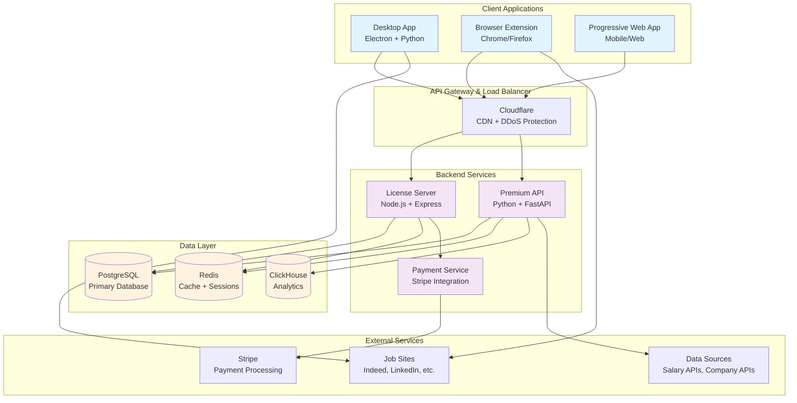
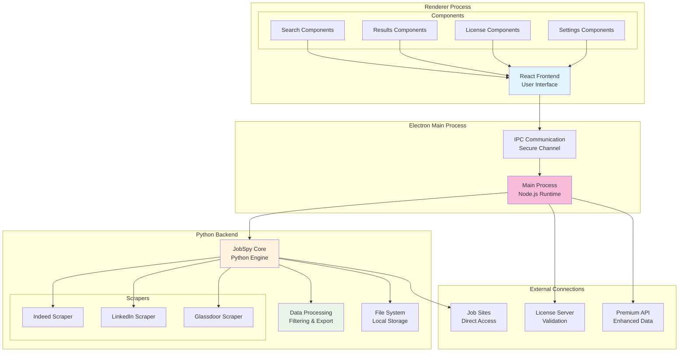
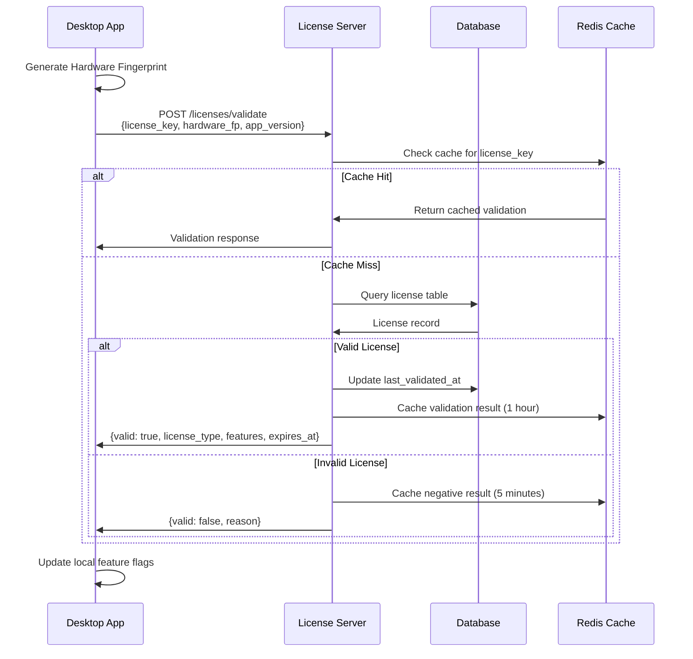
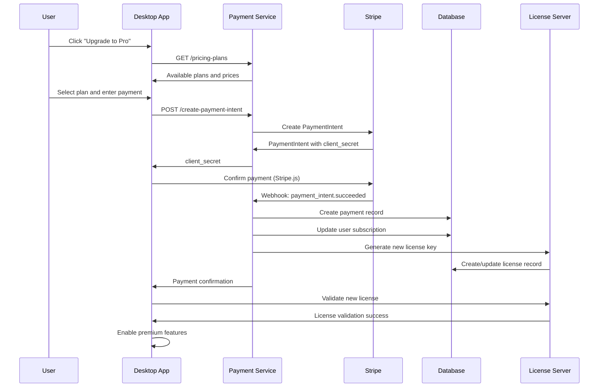
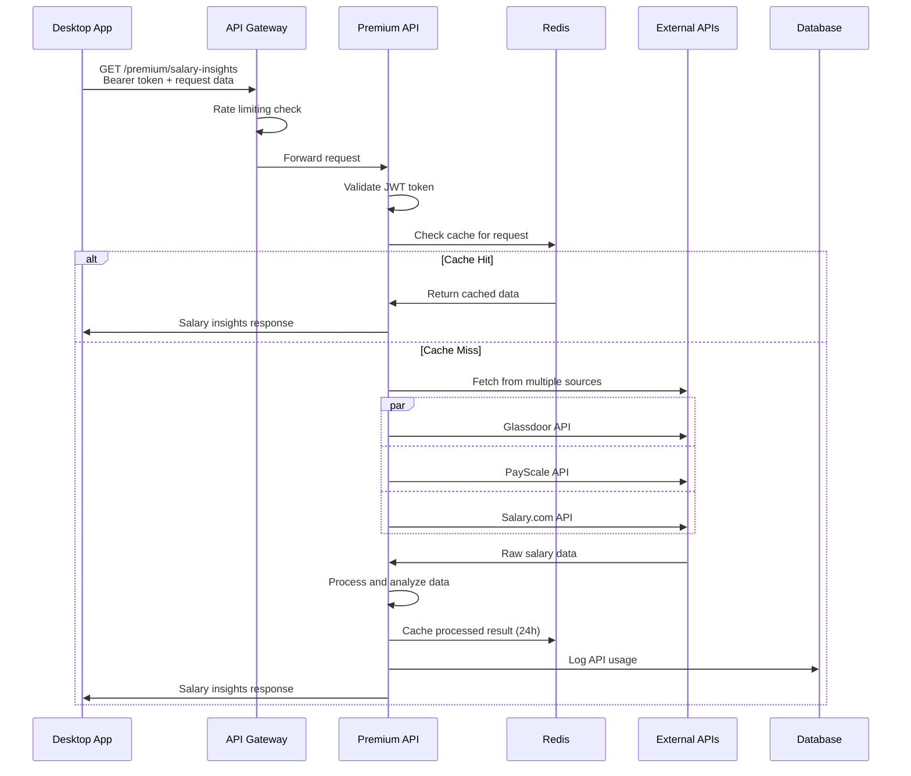
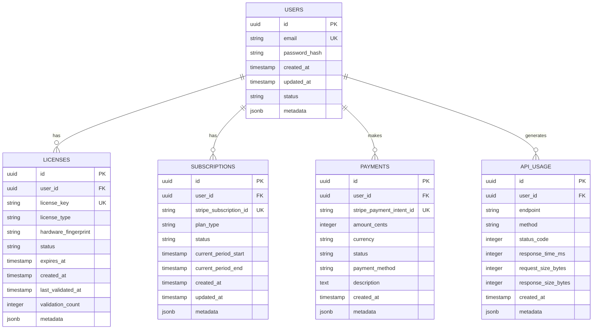
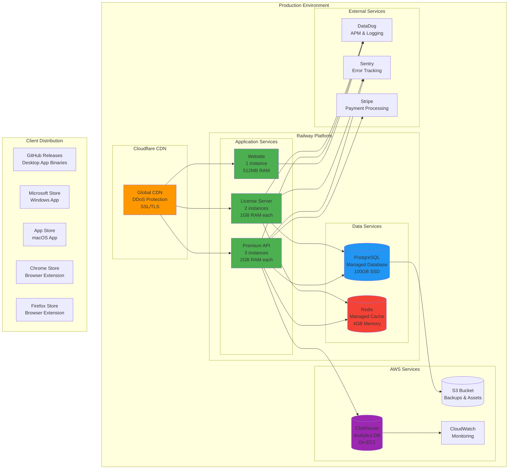
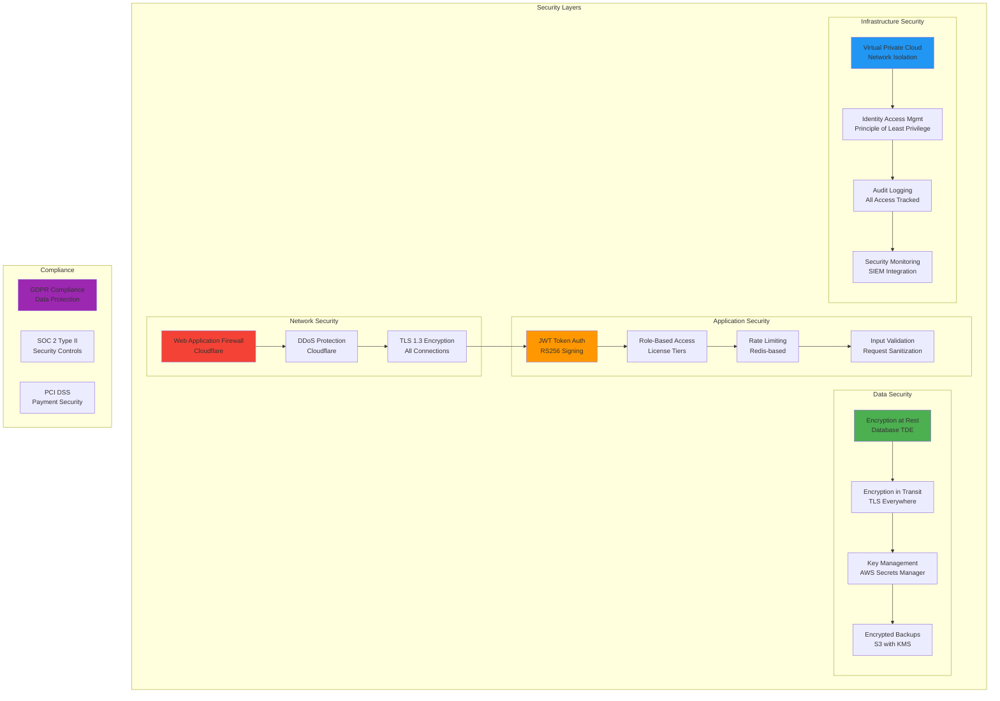
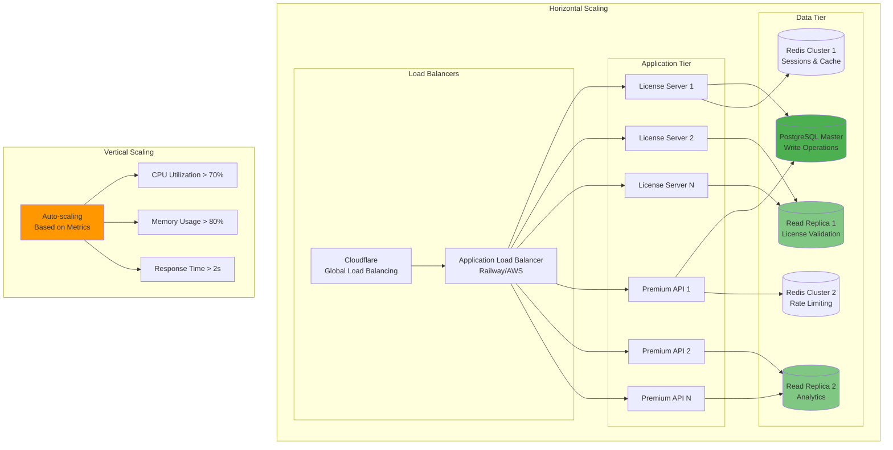

# System Architecture Diagrams

## Overview

This document contains visual representations of the JobSpy ecosystem architecture, including system diagrams, data flow diagrams, and deployment architecture.

## 1. High-Level System Architecture

## 2. Desktop Application Architecture

## 3. License Validation Flow

## 4. Payment and Subscription Flow

## 5. Premium Data API Flow

## 6. Data Architecture

## 7. Deployment Architecture

## 8. Security Architecture

## 9. Monitoring Architecture

```mermaid
graph TB
    subgraph "Application Layer"
        APP[Applications<br/>License Server<br/>Premium API]
        LOGS[Application Logs<br/>Structured JSON]
        METRICS[Custom Metrics<br/>Business KPIs]
        TRACES[Distributed Traces<br/>OpenTelemetry]
    end
    
    subgraph "Infrastructure Layer"
        INFRA[Infrastructure<br/>Railway Platform<br/>AWS Services]
        SYS[System Metrics<br/>CPU, Memory, Disk]
        NET[Network Metrics<br/>Latency, Throughput]
    end
    
    subgraph "Monitoring Platform"
        DD[DataDog<br/>APM & Infrastructure]
        PROM[Prometheus<br/>Metrics Collection]
        GRAF[Grafana<br/>Dashboards]
        ALERT[AlertManager<br/>Notifications]
    end
    
    subgraph "Notification Channels"
        SLACK[Slack<br/>Team Notifications]
        EMAIL[Email<br/>Critical Alerts]
        PHONE[Phone/SMS<br/>Emergency Escalation]
        TICKET[PagerDuty<br/>Incident Management]
    end
    
    APP --> LOGS
    APP --> METRICS
    APP --> TRACES
    
    INFRA --> SYS
    INFRA --> NET
    
    LOGS --> DD
    METRICS --> PROM
    TRACES --> DD
    SYS --> DD
    NET --> DD
    
    PROM --> GRAF
    DD --> ALERT
    GRAF --> ALERT
    
    ALERT --> SLACK
    ALERT --> EMAIL
    ALERT --> PHONE
    ALERT --> TICKET
    
    style APP fill:#4caf50
    style DD fill:#ff6b6b
    style ALERT fill:#ffa726
    style SLACK fill:#4a154b
```

## 10. Scalability Architecture

---

**Note**: These diagrams provide a comprehensive visual overview of the JobSpy ecosystem architecture. They can be rendered using any Mermaid-compatible tool or online editors like mermaid.live or draw.io.