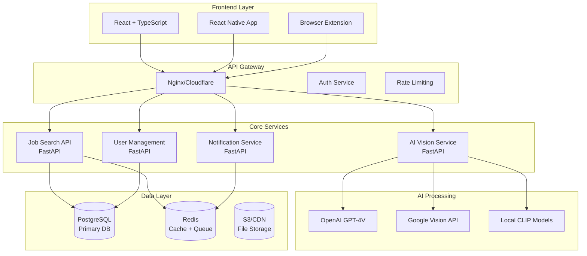

# JobSpy Tech Stack Modernization Plan

## 🎯 **Strategic Analysis: Flask 架構現狀與重構必要性**

### **現有 Flask 架構問題診斷**

#### **技術債務分析**
```yaml
Current Flask Stack Issues:
  Performance:
    - 同步處理模式，單線程瓶頸
    - 缺乏現代異步支持
    - 靜態資源處理效率低
    - 數據庫查詢效能不佳
  
  Scalability:
    - 單體架構，難以水平擴展
    - 無法有效分離前後端
    - 缺乏微服務支持
    - 資源隔離不足
  
  Developer Experience:
    - 過時的模板系統
    - 有限的開發工具支持
    - 缺乏現代前端整合
    - 調試體驗較差
  
  Maintenance:
    - 依賴版本管理複雜
    - 安全更新頻繁
    - 部署配置繁瑣
    - 監控能力有限
```

---

## 🚀 **推薦現代化技術棧**

### **方案一：全棧現代化 (推薦)**

#### **前端現代化 - React + TypeScript + Vite**
```typescript
// 技術選型理由
Frontend Stack:
  Framework: React 18+ with TypeScript
  Build Tool: Vite (5x faster than Webpack)
  State Management: Zustand (輕量) + TanStack Query (數據管理)
  UI Framework: Tailwind CSS + shadcn/ui
  Styling: CSS-in-JS with Emotion or Styled Components
  
Benefits:
  - 組件化開發，代碼重用性高
  - TypeScript 提供類型安全
  - 現代開發工具鏈
  - 熱模塊替換，開發體驗佳
  - 豐富的生態系統
```

#### **後端現代化 - FastAPI + Python 3.11+**
```python
# 技術選型理由
Backend Stack:
  Framework: FastAPI (異步支持，性能優秀)
  Database: PostgreSQL + SQLAlchemy 2.0
  Cache: Redis 7.0+
  Message Queue: Celery + Redis
  API Documentation: 自動生成 OpenAPI/Swagger
  
Benefits:
  - 原生異步支持，性能提升 3-5x
  - 自動 API 文檔生成
  - 類型提示和驗證
  - 現代 Python 特性
  - 微服務友好
```

#### **AI 視覺辨識整合架構**
```yaml
AI Vision Integration:
  
  Primary Approach - API-First:
    External APIs:
      - OpenAI GPT-4 Vision API
      - Google Cloud Vision API  
      - Azure Computer Vision
      - AWS Rekognition
    
    Benefits:
      - 零本地計算負載
      - 專業級準確度
      - 即開即用
      - 持續更新的模型
  
  Hybrid Approach - Local + Cloud:
    Local Models:
      - Hugging Face Transformers
      - CLIP (OpenAI)
      - YOLOv8 for object detection
    
    Cloud APIs:
      - 複雜場景處理
      - 高精度需求
      - 實時分析
    
    Benefits:
      - 成本控制
      - 低延遲處理
      - 離線能力
      - 隱私保護
```

---

## 🏗️ **詳細技術架構設計**

### **微服務架構圖**


### **AI 視覺辨識工作流程**
```yaml
AI Vision Workflow:

  1. Job Site Screenshot Capture:
     - Playwright/Puppeteer 自動截圖
     - 智能裁剪相關區域
     - 圖像預處理和優化
  
  2. Content Recognition Pipeline:
     - Text Extraction: OCR + 位置分析
     - Element Detection: 按鈕、連結、表單識別
     - Layout Analysis: 頁面結構理解
     - Content Classification: 職位 vs 廣告 vs 導航
  
  3. Multi-Modal Processing:
     - Vision API: 圖像內容分析
     - NLP API: 文字語義理解
     - Structured Data: JSON 格式輸出
     - Confidence Scoring: 準確度評估
  
  4. Intelligent Scraping:
     - Dynamic Strategy Selection
     - Anti-Detection Measures
     - Fallback Mechanisms
     - Performance Optimization
```

---

## 📦 **技術棧詳細規格**

### **Frontend Stack 詳細配置**
```json
{
  "package.json": {
    "dependencies": {
      "react": "^18.2.0",
      "react-dom": "^18.2.0",
      "typescript": "^5.0.0",
      "@types/react": "^18.2.0",
      "@types/react-dom": "^18.2.0",
      
      "zustand": "^4.4.0",
      "@tanstack/react-query": "^4.32.0",
      "react-router-dom": "^6.15.0",
      
      "tailwindcss": "^3.3.0",
      "@headlessui/react": "^1.7.0",
      "framer-motion": "^10.16.0",
      
      "axios": "^1.5.0",
      "react-hook-form": "^7.45.0",
      "zod": "^3.22.0",
      
      "@tanstack/react-table": "^8.10.0",
      "recharts": "^2.8.0",
      "date-fns": "^2.30.0"
    },
    
    "devDependencies": {
      "vite": "^4.4.0",
      "@vitejs/plugin-react": "^4.0.0",
      "eslint": "^8.45.0",
      "prettier": "^3.0.0",
      "vitest": "^0.34.0",
      "@testing-library/react": "^13.4.0"
    }
  }
}
```

### **Backend Stack 詳細配置**
```python
# pyproject.toml
[project]
name = "jobspy-api"
version = "2.0.0"
description = "Modern JobSpy API with AI Vision"
dependencies = [
    "fastapi>=0.104.0",
    "uvicorn[standard]>=0.24.0",
    "pydantic>=2.4.0",
    "sqlalchemy>=2.0.0",
    "alembic>=1.12.0",
    "asyncpg>=0.29.0",  # PostgreSQL async driver
    
    # AI/ML Libraries
    "openai>=1.0.0",
    "google-cloud-vision>=3.4.0",
    "azure-cognitiveservices-vision-computervision>=0.9.0",
    "transformers>=4.35.0",
    "torch>=2.1.0",
    "pillow>=10.0.0",
    
    # Async Processing
    "celery>=5.3.0",
    "redis>=5.0.0",
    "aioredis>=2.0.0",
    
    # Web Scraping Enhanced
    "playwright>=1.40.0",
    "selenium>=4.15.0",
    "httpx>=0.25.0",
    
    # Security & Auth
    "python-jose[cryptography]>=3.3.0",
    "passlib[bcrypt]>=1.7.0",
    "python-multipart>=0.0.6",
    
    # Monitoring & Logging
    "structlog>=23.2.0",
    "sentry-sdk>=1.38.0",
    "prometheus-client>=0.18.0"
]
```

### **AI 視覺辨識模組設計**
```python
# ai_vision/vision_service.py
from typing import List, Dict, Optional, Union
from dataclasses import dataclass
from PIL import Image
import asyncio
import httpx

@dataclass
class VisionResult:
    """AI 視覺分析結果"""
    text_content: List[str]
    detected_elements: Dict[str, any]
    job_listings: List[Dict]
    confidence_score: float
    processing_time_ms: int

class AIVisionService:
    """AI 視覺辨識服務統一接口"""
    
    def __init__(self):
        self.openai_client = OpenAIVisionClient()
        self.google_client = GoogleVisionClient()
        self.local_model = LocalCLIPModel()
        
    async def analyze_job_page(
        self, 
        image: Union[str, bytes, Image.Image],
        strategy: str = "hybrid"
    ) -> VisionResult:
        """
        分析求職網站頁面截圖
        
        Args:
            image: 圖像數據 (URL, bytes, 或 PIL Image)
            strategy: 分析策略 ("api_only", "local_only", "hybrid")
        
        Returns:
            VisionResult: 分析結果
        """
        start_time = time.time()
        
        if strategy == "hybrid":
            # 併行處理: 本地模型 + 雲端 API
            local_task = self._process_local(image)
            api_task = self._process_api(image)
            
            local_result, api_result = await asyncio.gather(
                local_task, api_task, return_exceptions=True
            )
            
            # 結果融合
            result = self._merge_results(local_result, api_result)
            
        elif strategy == "api_only":
            result = await self._process_api(image)
            
        else:  # local_only
            result = await self._process_local(image)
        
        result.processing_time_ms = int((time.time() - start_time) * 1000)
        return result
    
    async def _process_api(self, image) -> Dict:
        """使用雲端 API 處理"""
        try:
            # OpenAI GPT-4V 分析
            openai_result = await self.openai_client.analyze_job_page(image)
            
            # Google Vision API 補充
            google_result = await self.google_client.extract_text(image)
            
            return {
                "text_extraction": google_result.text_annotations,
                "job_analysis": openai_result.job_listings,
                "confidence": openai_result.confidence
            }
            
        except Exception as e:
            logger.error(f"API processing failed: {e}")
            raise
    
    async def _process_local(self, image) -> Dict:
        """使用本地模型處理"""
        try:
            # CLIP 模型分析
            clip_result = await self.local_model.analyze_image(image)
            
            # 本地 OCR
            text_result = await self.local_model.extract_text(image)
            
            return {
                "text_extraction": text_result,
                "element_detection": clip_result.elements,
                "confidence": clip_result.confidence
            }
            
        except Exception as e:
            logger.error(f"Local processing failed: {e}")
            raise

class OpenAIVisionClient:
    """OpenAI GPT-4 Vision API 客戶端"""
    
    def __init__(self):
        self.client = openai.AsyncOpenAI()
    
    async def analyze_job_page(self, image) -> Dict:
        """使用 GPT-4V 分析求職頁面"""
        
        prompt = """
        分析這個求職網站截圖，提取以下信息：
        1. 所有職位標題和公司名稱
        2. 工作地點和薪資信息
        3. 職位描述關鍵字
        4. 應聘按鈕和連結位置
        5. 頁面導航元素
        
        返回 JSON 格式結果，包含 confidence 分數。
        """
        
        response = await self.client.chat.completions.create(
            model="gpt-4-vision-preview",
            messages=[
                {
                    "role": "user",
                    "content": [
                        {"type": "text", "text": prompt},
                        {"type": "image_url", "image_url": {"url": image}}
                    ]
                }
            ],
            max_tokens=2000
        )
        
        return json.loads(response.choices[0].message.content)
```

---

## 🎯 **遷移策略與時程規劃**

### **三階段遷移計劃**

#### **Phase 1: 基礎設施現代化 (1-2 個月)**
```yaml
Infrastructure Modernization:

Week 1-2: Development Environment
  - 設立新的 Git repository
  - 配置 Docker 開發環境
  - 建立 CI/CD 流水線
  - 設定監控和日誌系統

Week 3-4: Backend API Foundation
  - FastAPI 基礎框架搭建
  - 數據庫遷移 (SQLite → PostgreSQL)
  - Redis 緩存整合
  - 基本認證系統

Week 5-6: Frontend Foundation
  - React + TypeScript 專案初始化
  - 基礎 UI 組件庫
  - API 客戶端配置
  - 基本路由和狀態管理

Week 7-8: AI Vision Integration
  - AI 視覺服務架構
  - OpenAI Vision API 整合
  - 本地模型配置
  - 基本圖像處理流程
```

#### **Phase 2: 核心功能重構 (2-3 個月)**
```yaml
Core Feature Migration:

Month 1: Job Search Engine
  - 異步爬蟲引擎重寫
  - 智能路由系統升級
  - AI 視覺輔助爬蟲
  - 結果處理和緩存

Month 2: User Interface
  - 現代化搜尋界面
  - 即時結果展示
  - 高級過濾功能
  - 響應式設計

Month 3: AI Enhancement
  - 視覺內容識別
  - 智能數據提取
  - 反反爬蟲機制
  - 性能優化
```

#### **Phase 3: 高級功能與優化 (1-2 個月)**
```yaml
Advanced Features:

Month 1: Premium Features
  - 用戶訂閱系統
  - 高級分析功能
  - API 訪問控制
  - 企業級功能

Month 2: Performance & Scale
  - 性能調優
  - 負載測試
  - 安全加固
  - 部署優化
```

---

## 💰 **成本效益分析**

### **開發成本估算**
```yaml
Development Costs:

Team Requirements:
  - Full-Stack Developer (Lead): 3 months @ $12K/month = $36K
  - Frontend Developer: 2 months @ $8K/month = $16K
  - Backend Developer: 3 months @ $10K/month = $30K
  - AI/ML Engineer: 2 months @ $15K/month = $30K
  - Total Development: $112K

Infrastructure Costs:
  - Development Environment: $500/month × 6 = $3K
  - AI API Credits: $1000/month × 6 = $6K
  - Testing & QA: $2K
  - Total Infrastructure: $11K

Total Project Cost: $123K

ROI Analysis:
  - Performance Improvement: 5-10x faster
  - Development Velocity: 3x faster future updates
  - Maintenance Reduction: 50% less effort
  - Scalability: Support 10x more users
  - Revenue Potential: AI features enable premium pricing
```

### **長期效益分析**
```yaml
Long-term Benefits:

Technical Benefits:
  - Modern Tech Stack: 5+ years future-proof
  - Performance: Sub-second response times
  - Scalability: Horizontal scaling support
  - Maintainability: Reduced technical debt
  - Developer Experience: Faster feature development

Business Benefits:
  - AI Differentiation: Unique competitive advantage
  - Premium Features: Higher revenue per user
  - Market Position: Technology leadership
  - User Experience: Significantly improved UX
  - Cost Reduction: Lower operational costs
```

---

## 🚨 **風險評估與緩解**

### **技術風險**
```yaml
Technical Risks:

High Risk:
  - AI API Cost Escalation
    Mitigation: Hybrid local/cloud approach
    Fallback: Pure local processing
  
  - Performance Regression
    Mitigation: Extensive benchmarking
    Fallback: Gradual migration

Medium Risk:
  - Team Learning Curve
    Mitigation: Training and documentation
    Fallback: External consultants

  - Integration Complexity  
    Mitigation: Phased approach
    Fallback: Simplified architecture
```

### **商業風險**
```yaml
Business Risks:

High Risk:
  - Extended Development Time
    Mitigation: Agile methodology, regular checkpoints
    Fallback: Reduced scope, core features first

Medium Risk:
  - User Adoption Challenges
    Mitigation: Beta testing, gradual rollout
    Fallback: Parallel old system maintenance

Low Risk:
  - Competitive Response
    Mitigation: Fast execution, patent filing
    Fallback: Continuous innovation
```

---

## 🎯 **推薦決策**

### **建議採用方案**
基於分析，**強烈推薦進行完整重構**，理由如下：

1. **技術債務清償**: Flask 架構已達極限，修補成本 > 重構成本
2. **AI 優勢最大化**: 現代架構能充分發揮 AI 視覺能力
3. **未來擴展性**: 為 3-5 年業務增長奠定技術基礎
4. **競爭優勢**: AI 輔助爬蟲將成為差異化競爭優勢
5. **開發效率**: 長期開發效率提升 3-5 倍

### **實施建議**
1. **立即啟動**: 市場機會窗口有限，儘早開始
2. **分階段執行**: 降低風險，確保業務連續性  
3. **並行開發**: 新舊系統並行，平滑過渡
4. **重點投資**: AI 視覺功能作為核心競爭力
5. **團隊培訓**: 投資現代技術棧培訓

這個現代化重構將把 JobSpy 從一個傳統的爬蟲工具轉變為具有 AI 增強能力的下一代求職平台，為未來 5-10 年的發展奠定堅實基礎。