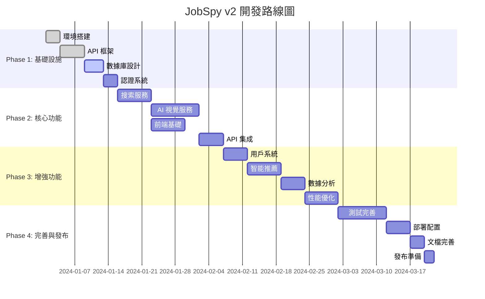

# JobSpy v2 開發路線圖

## 🎯 總體時程規劃

### 階段概覽 (12-16週總計)



## 📋 Phase 1: 基礎設施搭建 (2週)

### Week 1: 核心架構

#### 🎯 Sprint 1.1: 項目初始化 (3天)
**目標**: 完成開發環境搭建和基礎框架

**任務清單**:
- [x] ✅ JobSpy-v2 項目結構創建
- [x] ✅ Docker 開發環境配置
- [x] ✅ FastAPI 基礎框架搭建
- [ ] 🔄 PostgreSQL + Redis 容器配置
- [ ] 📝 環境變量管理 (.env 配置)
- [ ] 🔧 基礎中間件設置 (CORS, 日誌)

**驗收標準**:
- Docker Compose 可以成功啟動所有服務
- FastAPI 可以正常回應 `/health` 端點
- 數據庫連接正常，可以執行基本 CRUD 操作

**預估工作量**: 20 小時

#### 🎯 Sprint 1.2: 數據庫設計 (4天)
**目標**: 完成核心數據模型設計和數據庫配置

**任務清單**:
- [ ] 📊 數據庫 Schema 設計
  - [ ] 用戶表結構設計
  - [ ] 職位信息表設計
  - [ ] 搜索記錄表設計
  - [ ] AI 分析緩存表設計
- [ ] 🔄 Alembic 遷移配置
- [ ] 📝 SQLAlchemy Models 實現
- [ ] 🧪 數據庫初始化腳本
- [ ] 📈 基礎索引和性能優化

**驗收標準**:
- 所有表結構創建成功
- 數據庫遷移腳本可以正常執行
- 基本的數據模型可以進行 CRUD 操作

**預估工作量**: 28 小時

### Week 2: 認證與基礎服務

#### 🎯 Sprint 1.3: 認證系統 (3天)
**目標**: 實現用戶認證和授權系統

**任務清單**:
- [ ] 🔐 JWT Token 實現
- [ ] 👤 用戶註冊/登錄 API
- [ ] 🛡️ 權限中間件實現
- [ ] 🔑 密碼加密和驗證
- [ ] ⏰ Token 刷新機制
- [ ] 🧪 認證相關單元測試

**驗收標準**:
- 用戶可以成功註冊和登錄
- JWT Token 可以正確驗證和刷新
- 受保護的 API 端點需要有效 Token

**預估工作量**: 22 小時

#### 🎯 Sprint 1.4: API 框架完善 (2天)
**目標**: 完善 API 基礎設施

**任務清單**:
- [ ] 📋 統一響應格式實現
- [ ] ❌ 錯誤處理中間件
- [ ] 📊 請求日誌和監控
- [ ] 🚦 API 速率限制
- [ ] 📖 自動 API 文檔生成

**驗收標準**:
- 所有 API 返回統一格式響應
- 錯誤處理機制完善
- Swagger 文檔可以正常訪問

**預估工作量**: 14 小時

## 🔍 Phase 2: 核心功能開發 (4週)

### Week 3-4: 搜索服務核心

#### 🎯 Sprint 2.1: 基礎搜索服務 (1週)
**目標**: 實現多平台求職搜索的核心功能

**任務清單**:
- [ ] 🔍 搜索 API 端點設計
- [ ] 🌐 Indeed API 集成
- [ ] 🔗 LinkedIn 數據獲取
- [ ] 👔 Glassdoor 爬蟲實現
- [ ] 🔄 異步搜索處理
- [ ] 📊 搜索結果統一格式化
- [ ] 💾 Redis 緩存實現

**驗收標準**:
- 可以同時搜索至少 3 個求職平台
- 搜索結果在 5 秒內返回
- 搜索結果格式統一且包含必要信息

**預估工作量**: 35 小時

#### 🎯 Sprint 2.2: AI 視覺分析系統 (1.5週)
**目標**: 實現 AI 驅動的頁面分析功能

**任務清單**:
- [ ] 🤖 OpenAI GPT-4V 集成
- [ ] 👁️ 本地 VLM (CLIP) 配置
- [ ] 📸 頁面截圖服務
- [ ] 🧠 智能成本控制邏輯
- [ ] 🔄 三層分析策略實現
  - [ ] Layer 1: API 優先
  - [ ] Layer 2: 傳統爬蟲
  - [ ] Layer 3: AI 視覺分析
- [ ] 💰 成本分析模塊
- [ ] 🏊‍♀️ 資源池管理系統

**驗收標準**:
- AI 視覺分析可以正確提取職位信息
- 成本控制在預算範圍內 ($50/月開發期間)
- 本地 VLM 可以作為備用方案正常工作

**預估工作量**: 50 小時

### Week 5-6: 前端開發

#### 🎯 Sprint 2.3: React 前端基礎 (1週)
**目標**: 搭建現代化用戶界面

**任務清單**:
- [ ] ⚛️ React + TypeScript 項目初始化
- [ ] 🎨 Tailwind CSS + Headless UI 設置
- [ ] 📱 響應式布局設計
- [ ] 🔍 搜索頁面組件
- [ ] 📋 職位列表組件
- [ ] 📄 職位詳情模態框
- [ ] 🔄 加載狀態管理
- [ ] 📊 狀態管理 (Zustand)

**驗收標準**:
- 搜索界面美觀且易用
- 響應式設計在各種設備上正常顯示
- 用戶可以輸入搜索條件並查看結果

**預估工作量**: 35 小時

#### 🎯 Sprint 2.4: 前後端集成 (0.5週)
**目標**: 完成前後端數據交互

**任務清單**:
- [ ] 🔌 API 客戶端實現 (axios)
- [ ] 🔄 TanStack Query 集成
- [ ] 🎣 搜索數據獲取 hooks
- [ ] ❌ 錯誤邊界處理
- [ ] ⏳ 實時搜索狀態顯示
- [ ] 🧪 前端單元測試

**驗收標準**:
- 前端可以成功調用後端 API
- 搜索結果可以正確顯示
- 錯誤情況有適當的用戶提示

**預估工作量**: 18 小時

## 🚀 Phase 3: 增強功能 (3週)

### Week 7-8: 用戶系統與智能功能

#### 🎯 Sprint 3.1: 用戶系統完善 (0.5週)
**目標**: 完善用戶管理功能

**任務清單**:
- [ ] 👤 用戶資料管理
- [ ] ⚙️ 用戶偏好設置
- [ ] 📋 搜索歷史記錄
- [ ] ⭐ 職位收藏功能
- [ ] 🔔 搜索結果通知
- [ ] 📊 用戶儀表板

**驗收標準**:
- 用戶可以管理個人資料和偏好
- 搜索歷史可以正確保存和查看
- 收藏功能正常工作

**預估工作量**: 20 小時

#### 🎯 Sprint 3.2: 智能推薦系統 (1週)
**目標**: 實現基於 AI 的職位推薦

**任務清單**:
- [ ] 🧠 用戶畫像構建算法
- [ ] 🤝 協同過濾推薦實現
- [ ] 📈 機器學習模型訓練
- [ ] 🎯 個性化推薦 API
- [ ] 📊 推薦效果分析
- [ ] 🔄 A/B 測試框架

**驗收標準**:
- 系統可以根據用戶歷史推薦相關職位
- 推薦準確率達到 70% 以上
- A/B 測試框架可以正常工作

**預估工作量**: 35 小時

#### 🎯 Sprint 3.3: 數據分析功能 (0.5週)
**目標**: 提供市場趨勢分析

**任務清單**:
- [ ] 📈 薪資趨勢分析
- [ ] 🏢 公司招聘趨勢
- [ ] 🌍 地區就業數據
- [ ] 💼 技能需求統計
- [ ] 📊 數據可視化組件
- [ ] 📋 分析報告生成

**驗收標準**:
- 用戶可以查看各種市場趨勢圖表
- 數據分析結果準確且有意義
- 報告可以導出為 PDF 格式

**預估工作量**: 18 小時

### Week 9: 性能優化

#### 🎯 Sprint 3.4: 性能優化 (1週)
**目標**: 提升系統性能和穩定性

**任務清單**:
- [ ] ⚡ 數據庫查詢優化
- [ ] 💾 多級緩存策略實現
- [ ] 🔄 異步處理優化
- [ ] 📦 前端代碼分割和懶加載
- [ ] 🖼️ 圖片壓縮和 CDN
- [ ] 📊 性能監控實現
- [ ] 🧪 負載測試

**驗收標準**:
- API 響應時間 < 500ms (95th percentile)
- 頁面加載時間 < 2 秒
- 可以支持 100+ 並發用戶

**預估工作量**: 30 小時

## 🧪 Phase 4: 測試與發布 (3週)

### Week 10-11: 測試完善

#### 🎯 Sprint 4.1: 測試體系完善 (1.5週)
**目標**: 建立完整的測試體系

**任務清單**:
- [ ] 🧪 單元測試完善 (目標覆蓋率 80%+)
- [ ] 🔗 集成測試實現
- [ ] 🎭 E2E 測試 (Playwright)
- [ ] 📊 性能測試 (Locust)
- [ ] 🔐 安全測試
- [ ] 🤖 自動化測試流水線
- [ ] 📋 測試報告生成

**驗收標準**:
- 代碼覆蓋率達到 80% 以上
- 所有核心功能通過 E2E 測試
- 性能測試達到目標指標

**預估工作量**: 45 小時

#### 🎯 Sprint 4.2: Bug 修復與穩定性 (0.5週)
**目標**: 修復發現的問題並提升穩定性

**任務清單**:
- [ ] 🐛 Bug 修復
- [ ] 🔍 代碼審查
- [ ] 📊 性能瓶頸分析
- [ ] 🛡️ 安全漏洞修復
- [ ] 📝 錯誤處理改進
- [ ] 🔄 重試機制完善

**驗收標準**:
- 所有已知 Bug 修復完成
- 系統穩定性達到 99%+
- 安全掃描無高危漏洞

**預估工作量**: 20 小時

### Week 12: 部署與發布

#### 🎯 Sprint 4.3: 生產部署 (0.5週)
**目標**: 完成生產環境部署配置

**任務清單**:
- [ ] 🐳 Docker 生產鏡像構建
- [ ] ☸️ Kubernetes 部署配置
- [ ] 🔄 CI/CD 流水線設置
- [ ] 📊 監控和報警配置
- [ ] 🗄️ 數據庫遷移腳本
- [ ] 🔒 SSL 證書配置
- [ ] 🌐 域名和 DNS 設置

**驗收標準**:
- 應用可以在生產環境穩定運行
- CI/CD 流水線可以自動部署
- 監控系統正常工作

**預估工作量**: 18 小時

#### 🎯 Sprint 4.4: 文檔與發布準備 (0.5週)
**目標**: 完善文檔並準備發布

**任務清單**:
- [ ] 📖 API 文檔完善
- [ ] 👥 用戶使用手冊
- [ ] 🔧 部署運維文檔
- [ ] 🎯 發布計劃制定
- [ ] 📢 發布公告準備
- [ ] 🎉 Beta 用戶邀請

**驗收標準**:
- 所有文檔完整且易懂
- 發布計劃經過審查確認
- Beta 測試用戶準備就緒

**預估工作量**: 15 小時

## 📊 資源分配與團隊組織

### 團隊角色
```
👨‍💻 全棧開發 (1人): 
- 負責後端 API 開發
- 前端組件實現
- 系統集成

🤖 AI 工程師 (0.5人):
- AI 視覺分析實現
- 推薦算法開發
- 模型優化

🎨 UI/UX 設計師 (0.3人):
- 界面設計
- 用戶體驗優化
- 設計系統維護

🧪 測試工程師 (0.2人):
- 測試策略制定
- 自動化測試實現
- 質量保證
```

### 每週工作量分配
```
總工作量: 約 500-600 小時
每週目標: 40-50 小時
持續時間: 12-16 週

Phase 1 (基礎設施): 84 小時
Phase 2 (核心功能): 138 小時  
Phase 3 (增強功能): 103 小時
Phase 4 (測試發布): 98 小時
```

## 🚦 風險管理

### 高風險項目
1. **AI 成本超支**: 
   - 🛡️ 緩解策略: 嚴格成本控制，本地 VLM 備用
   - 📊 監控指標: 每日 API 調用成本

2. **性能瓶頸**:
   - 🛡️ 緩解策略: 早期性能測試，架構優化
   - 📊 監控指標: 響應時間，並發用戶數

3. **第三方 API 限制**:
   - 🛡️ 緩解策略: 多個數據源，智能重試
   - 📊 監控指標: API 成功率，錯誤率

### 質量把關檢查點

#### 每個 Sprint 結束時:
- [ ] 功能演示完成
- [ ] 代碼審查通過
- [ ] 單元測試覆蓋率 > 70%
- [ ] 集成測試通過

#### 每個 Phase 結束時:
- [ ] 完整功能測試
- [ ] 性能基準測試
- [ ] 安全掃描
- [ ] 用戶反饋收集

## 📈 成功指標

### 開發階段 KPIs
- **代碼質量**: 測試覆蓋率 > 80%，代碼審查通過率 100%
- **開發效率**: Sprint 完成率 > 90%，Bug 修復時間 < 24h
- **性能指標**: API 響應時間 < 500ms，頁面加載 < 2s
- **用戶體驗**: SUS 可用性評分 > 80

### 發布準備 KPIs
- **穩定性**: 系統正常運行時間 > 99%
- **安全性**: 無高危安全漏洞
- **文檔完整性**: 所有關鍵功能有使用文檔
- **用戶準備度**: Beta 用戶滿意度 > 85%

## 🎯 下一步行動

### 即時行動項 (本週)
1. **環境驗證**: 確認 JobSpy-v2 基礎環境運行正常
2. **團隊確認**: 確定開發資源和時間安排  
3. **工具準備**: 設置項目管理工具 (Jira/Linear)
4. **代碼規範**: 制定編碼標準和 Git 工作流

### 準備工作 (下週)
1. **數據庫設計評審**: 細化數據模型設計
2. **API 規範制定**: 確定 RESTful API 設計標準
3. **UI/UX 設計**: 開始界面設計和用戶流程
4. **開發環境**: 完善本地開發環境配置

你希望我們從哪個具體的 Sprint 開始？我建議我們先完成 Sprint 1.2 的數據庫設計，因為這是後續所有功能的基礎。